<!--
  ============================================================
  PROFILE README  ·  nihadmusa
  HTML comments render as nothing on GitHub - edit them freely.
  ============================================================
-->

  

  

  
  
  
  

  

##  `01 — About`

<table>
<tr>
<td width="330" valign="top">

**Hi, I'm Nihad Musayev** — a software developer based in Azerbaijan.

- Building Spring Boot microservices and REST APIs
- Daily stack: Java 21, Gradle, PostgreSQL, Redis, Kafka
- Focused on clean architecture and testable design
- Working on JWT / OAuth2 auth flows and caching layers
- Always up for a technical discussion

</td>
<td width="330" valign="top">

**What I work on**

- Migrating monoliths to service boundaries
- Authentication and authorization
- API performance and query tuning
- Docker-based local and CI environments
- Logging, metrics and basic alerting

**Principles:** KISS, SOLID, clean code, fail fast

</td>
</tr>
</table>

  

##  `02 — Stack`

  

<table>
<tr>
<td width="50%" valign="top">

**Backend**
- Java 17 / 21
- Spring Boot, Spring MVC
- Spring Data JPA, Hibernate
- Spring Security, JWT, OAuth2
- Bean validation, exception handling

</td>
<td valign="top">

**Data & Infrastructure**
- PostgreSQL, MySQL
- Redis (cache, session, rate limiting)
- Apache Kafka, RabbitMQ
- Docker, Docker Compose
- Gradle, Maven

</td>
</tr>
<tr>
<td valign="top">

**Architecture**
- Microservices
- REST API design
- Clean and hexagonal architecture
- CQRS, event-driven flows
- API Gateway

</td>
<td valign="top">

**Practice**
- Git flow, code review
- Container-first local setup
- Structured logging
- Unit and integration tests

</td>
</tr>
</table>

  

##  `03 — Code`

  

  

##  `04 — Activity`

  
  

  

  
Contribution graph as a game

   
  

    
  

 

  

  

##  `05 — Projects`

<table>
<tr>
<td width="50%" valign="top">

### Microservice Commerce Suite
API gateway, JWT auth, Redis cache, Docker Compose.

`Java` `Spring Boot` `Redis` `PostgreSQL` `Docker`

[Repository](https://github.com/nihadmusa) &nbsp;•&nbsp; [Source](https://github.com/nihadmusa)

</td>
<td valign="top">

### Library Management System
Role-based access, layered design, containerized setup.

`Java` `Spring Data JPA` `MySQL` `Maven`

[Repository](https://github.com/nihadmusa) &nbsp;•&nbsp; [Source](https://github.com/nihadmusa)

</td>
</tr>
<tr>
<td valign="top">

### JWT Auth Gateway
Stateless authentication and authorization with refresh tokens.

`Java` `Spring Security` `JWT` `Gradle`

[Repository](https://github.com/nihadmusa) &nbsp;•&nbsp; [Source](https://github.com/nihadmusa)

</td>
<td valign="top">

### Notification Service
Event-driven consumers with retry policy and dead-letter handling.

`Java` `Kafka` `Redis` `REST`

[Repository](https://github.com/nihadmusa) &nbsp;•&nbsp; [Source](https://github.com/nihadmusa)

</td>
</tr>
<tr>
<td valign="top">

### Redis Cache Layer
Reusable cache-aside pattern with TTL and hit metrics.

`Java` `Redis` `Micrometer`

[Repository](https://github.com/nihadmusa)

</td>
<td valign="top">

### Payment Notification
Callback processing with idempotency keys and alerting.

`Java` `Spring Boot` `REST` `PostgreSQL`

[Repository](https://github.com/nihadmusa)

</td>
</tr>
</table>

  

  

##  `06 — Contact`

  
  
  
  

  
  

  

