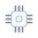

<!--
  ============================================================
  NEON PROFILE README  ·  nihadmusa
  Şərh satırları GitHub-da görünmür — tənzimləmək üçün.
  Özəllikləri dəyişmək üçün bu README-ni redaktə et.
  ============================================================
-->

  

  

  
  
  
  

  

##  `01 — About Me`

<table>
<tr>
<td width="330" valign="top">

**Salam, mən Nihad Musa** &#x2B55;  
Azərbaycandan **Java Backend Developer**.

- 🔭 Spring Boot mikroservisləri qururam
- 🛠 Java 21 · Gradle · PostgreSQL · Redis · Kafka
- 🌱 Distributed systems & clean architecture üzrə öyrənirəm
- ⚡ JWT / OAuth2 ilə təhlükəsizlik, Redis ilə caching
- 💬 Fikrimi soruşmaqdan çəkinmirəm — **pull req**

</td>
<td width="330" valign="top">

**Nə edirəm?**

- 📦 Monolith-dən mikroservisə smooth migration
- 🔐 Authentication / Authorization axınları
- ⚡️ API performans optimizasiyası
- 🧪 Testable, maintainable kod yazmaq
- 📊 Loglama, monitoring, alerting

**İş prinsipləri:** KISS · SOLID · Clean Code · Fail Fast

</td>
</tr>
</table>

> 💬 **Bir söz:** Düzgün arxitektura + sadə kod = uzunömürlü məhsul.

  

##  `02 — Tech Stack`

  

<table>
<tr><td width="50%" valign="top">

**Backend**
- Java 17 / 21
- Spring Boot · Spring MVC
- Spring Data JPA / Hibernate
- Spring Security · JWT · OAuth2
- Validation · Exception Handling

</td><td width="50%" valign="top">

**Infrastructure & Data**
- PostgreSQL · MySQL
- Redis (cache, session, rate-limit)
- Apache Kafka · RabbitMQ
- Docker · Docker Compose
- Gradle · Maven

</td></tr>
<tr><td valign="top">

**Architecture**
- Microservices
- REST API design
- Clean / Hexagonal architecture
- CQRS · Event-driven
- API Gateway

</td><td valign="top">

**Practices**
- Git Flow · Code Review
- Docker-first local env
- Logging · Metrics · Tracing
- Unit + Integration tests

</td></tr>
</table>

  

##  `03 — Inside My Code`

  

  
  
  

  

##  `04 — GitHub Analytics`

  
  

  

  

  
<b>🐍 Contribution Snake</b> — klikləyin

   
  

    
  

  

    
  

 

  

  
  

  

##  `05 — Projects`

<table>
<tr><td width="50%" valign="top">

### 🛒 Microservice Commerce Suite
Spring Boot microservices, API Gateway, JWT auth, Redis cache.

`Java` `Spring Boot` `Redis` `PostgreSQL` `Docker`

[Repo →](https://github.com/nihadmusa) &nbsp;•&nbsp; [Code →](https://github.com/nihadmusa)

</td><td width="50%" valign="top">

### 📚 Library Management System
CRUD + role-based access, Docker Compose, clean layering.

`Java` `Spring Data JPA` `MySQL` `Maven`

[Repo →](https://github.com/nihadmusa) &nbsp;•&nbsp; [Code →](https://github.com/nihadmusa)

</td></tr>
<tr><td valign="top">

### 🔐 JWT Auth Gateway
Stateless authentication & authorization service with refresh tokens.

`Java` `Spring Security` `JWT` `Gradle`

[Repo →](https://github.com/nihadmusa) &nbsp;•&nbsp; [Code →](https://github.com/nihadmusa)

</td><td valign="top">

### 📨 Notification Service
Event-driven notifications with Kafka consumers and retry policy.

`Java` `Kafka` `Redis` `REST`

[Repo →](https://github.com/nihadmusa) &nbsp;•&nbsp; [Code →](https://github.com/nihadmusa)

</td></tr>
<tr><td valign="top">

### ⚡ Redis Cache Layer
Generic cache-aside pattern with TTL + metrics.

`Java` `Redis` `Micrometer`

[Repo →](https://github.com/nihadmusa)

</td><td valign="top">

### 🧾 Payment Notification
Payment callback processing, idempotency, alerting.

`Java` `Spring Boot` `REST` `PostgreSQL`

[Repo →](https://github.com/nihadmusa)

</td></tr>
</table>

  

  

##  `06 — Contact`

  
  
  
  

  
  

  

  

